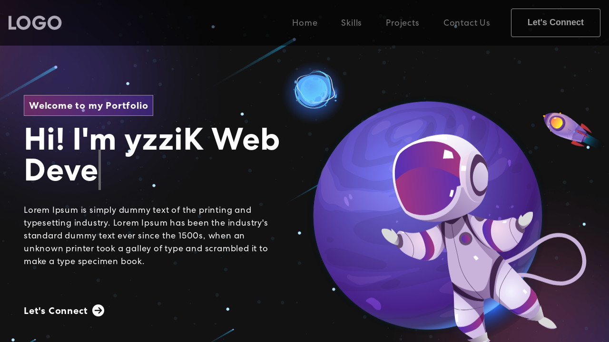
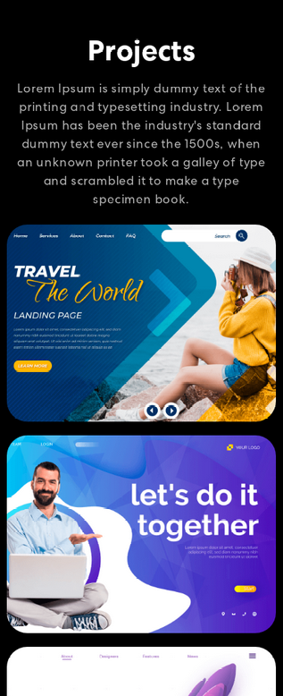

# Sample Kotlin Portfolio using Kobweb



## Screenshots

### Desktop


### Mobile





> **Note**
> This portfolio was originally made in react by [judygab](https://github.com/judygab) in [web-dev-projects/personal-portfolio](https://github.com/judygab/web-dev-projects/tree/main/personal-portfolio)


## Getting Started

First, run the development server by typing the following command in a terminal under the `site` folder:

```bash
$ cd site
$ kobweb run
```

Open [http://localhost:8080](http://localhost:8080) with your browser to see the result.

You can use any editor you want for the project, but we recommend using **IntelliJ IDEA Community Edition** downloaded
using the [Toolbox App](https://www.jetbrains.com/toolbox-app/).

Press `Q` in the terminal to gracefully stop the server.

### Live Reload

Feel free to edit / add / delete new components, pages, and API endpoints! When you make any changes, the site will
indicate the status of the build and automatically reload when ready.

## Exporting the Project

When you are ready to ship, you should shutdown the development server and then export the project using:

```bash
kobweb export
```

When finished, you can run a Kobweb server in production mode:

```bash
kobweb run --env prod
```

If you want to run this command in the Cloud provider of your choice, consider disabling interactive mode since nobody
is sitting around watching the console in that case anyway. To do that, use:

```bash
kobweb run --env prod --mode dumb
```

Kobweb also supports exporting to a static layout which is compatible with static hosting providers, such as GitHub
Pages, Netlify, Firebase, any presumably all the others. You can read more about that approach here:
https://bitspittle.dev/blog/2022/staticdeploy
